# Lab 5: Industrial Robotics. I/O Signals

This repository contains the modules in RAPID generated by RobotStudio. On one hand, you will find how through different input signals, we can control and select different routines to draw the letters AEC (our name initials) with the robot ABB IRB140 in an inclined and horizontal plane. On the other hand, you will find how with different input signals the robot can perform a routine of pick and place using a gripper and three different objects.

## Authors

- Maria Alejandra Arias Frontanilla
- Camilo Andres Vera Ruiz
- Edwin Alfredo Higuera Bustos

# Adding digital inputs to the lab 4

In the last [lab](https://github.com/ariasAleia/RobotStudio_Robotics_Lab4) we develop two rapid modules to execute two different paths to draw the letters "AEC" both on the floor and on an inclined plane, the results were satisfactory but there is a problem, this modules begin the trajectory execution immediately, after the program load, and it only executes a single trajectory a single time, but in a real industrial application this behavior will never be useful, a robot must automate some heavy or repetitive task so there is the necessity of execute a trajectory multiple times taking into account the state of the world around it, in other words executing some task at a given moment and at a given input state, such as buttons, sensors, controllers and so on.

In order to be able to do that, a rapid module with two buttons inputs is develop, the main idea is to execute any of the two last lab trajectories by the press of two buttons, each button to each trajectory.

The first step is to create some inputs, this can be achieved in RobotStudio by the option "Configuration - I/O System" as showed bellow. Two signal named DI_01 and DI_02 are created, the first one for the horizontal plane, and the second one for the inclined plane.

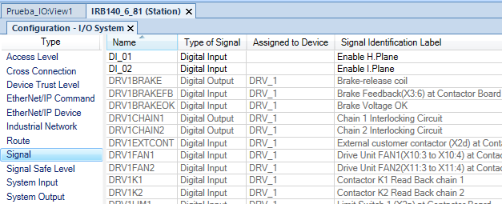

After the signals are created a controller reboot is needed so it can use this signals.

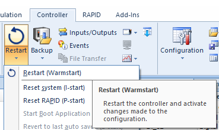

Then the RAPID code for the last lab is imported and some logic is added. Two work objects are defined, one for the horizontal plane and the other for the inclined plane. All the trajectories and targets were defined previously.

The logic is pretty simple, the main routine defined in `main()`, it executes an infinite loop that waits for a button using if statements, in the case of any of the buttons is pressed the full path is executed including homing both at beginning and ending of the movement. The code is showed bellow and the .mod file ready to use with the IRB140 robot can be found [here](Module1.mod)

```rapid
MODULE Module1
        PERS tooldata Marcador:=[TRUE,[[0,-0.174,150.662],[0.981957062,0.189104012,0,0]],[0.1,[0.001,0,66.262],[1,0,0,0],0,0,0]];
    TASK PERS wobjdata Tablero:=[FALSE,TRUE,"",[[424.865,295.588,71.2],[1,0,0,0]],[[0,0,0],[1,0,0,0]]];
    CONST robtarget Target_Up:=[[140,125,150],[0,0,1,0],[0,0,0,0],[9E+09,9E+09,9E+09,9E+09,9E+09,9E+09]];
    CONST robtarget Target_A1:=[[145,210,0],[0,0,1,0],[0,1,-1,0],[9E+09,9E+09,9E+09,9E+09,9E+09,9E+09]];
    CONST robtarget Target_A2:=[[265,170,0],[0,0,1,0],[0,0,-1,0],[9E+09,9E+09,9E+09,9E+09,9E+09,9E+09]];
    CONST robtarget Target_A3:=[[145,130,0],[0,0,1,0],[0,1,-1,0],[9E+09,9E+09,9E+09,9E+09,9E+09,9E+09]];
    CONST robtarget Target_Home:=[[636.768770631,-0.174,604.169],[0.490978531,0.094552006,0.850399762,-0.163768878],[0,-1,0,0],[9E+09,9E+09,9E+09,9E+09,9E+09,9E+09]];
    CONST robtarget Target_E1:=[[145,30,0],[0,0,1,0],[0,0,0,0],[9E+09,9E+09,9E+09,9E+09,9E+09,9E+09]];
    CONST robtarget Target_E2:=[[145,110,0],[0,0,1,0],[0,1,-1,0],[9E+09,9E+09,9E+09,9E+09,9E+09,9E+09]];
    CONST robtarget Target_E3:=[[265,110,0],[0,0,1,0],[0,0,-1,0],[9E+09,9E+09,9E+09,9E+09,9E+09,9E+09]];
    CONST robtarget Target_E4:=[[265,30,0],[0,0,1,0],[0,0,-1,0],[9E+09,9E+09,9E+09,9E+09,9E+09,9E+09]];
    CONST robtarget Target_C1:=[[90,85,0],[0,0,1,0],[0,1,-2,0],[9E+09,9E+09,9E+09,9E+09,9E+09,9E+09]];
    CONST robtarget Target_C2:=[[130,125,0],[0,0,1,0],[0,1,-1,0],[9E+09,9E+09,9E+09,9E+09,9E+09,9E+09]];
    CONST robtarget Target_C3:=[[90,165,0],[0,0,1,0],[0,1,-1,0],[9E+09,9E+09,9E+09,9E+09,9E+09,9E+09]];
    CONST robtarget Target_C4:=[[50,165,0],[0,0,1,0],[0,1,-2,0],[9E+09,9E+09,9E+09,9E+09,9E+09,9E+09]];
    CONST robtarget Target_C5:=[[10,125,0],[0,0,1,0],[0,1,-2,0],[9E+09,9E+09,9E+09,9E+09,9E+09,9E+09]];
    CONST robtarget Target_C6:=[[50,85,0],[0,0,1,0],[0,1,-2,0],[9E+09,9E+09,9E+09,9E+09,9E+09,9E+09]];
    CONST robtarget Target_LineA:=[[205,190,0],[0,0,1,0],[0,0,0,0],[9E+09,9E+09,9E+09,9E+09,9E+09,9E+09]];
    CONST robtarget Target_LineA_End:=[[205,150,0],[0,0,1,0],[0,0,-1,0],[9E+09,9E+09,9E+09,9E+09,9E+09,9E+09]];
    CONST robtarget Target_LineE:=[[205,110,0],[0,0,1,0],[0,0,-1,0],[9E+09,9E+09,9E+09,9E+09,9E+09,9E+09]];
    CONST robtarget Target_LineE_End:=[[205,40,0],[0,0,1,0],[0,0,-1,0],[9E+09,9E+09,9E+09,9E+09,9E+09,9E+09]];

    PROC main()
        WHILE TRUE DO
            IF DI_01 = 1 THEN
                Tablero:=[FALSE,TRUE,"",[[424.865,295.588,71.2],[1,0,0,0]],[[0,0,0],[1,0,0,0]]];
                Path_A;
                Path_E;
                Path_C;
                Path_Lines;
            ENDIF
            IF DI_02 = 1 THEN
                Tablero:=[FALSE,TRUE,"",[[186.9,-412.1,71.2],[0.683012702,-0.183012702,-0.183012702,-0.683012702]],[[0,0,0],[1,0,0,0]]];
                Path_A;
                Path_E;
                Path_C;
                Path_Lines;
            ENDIF
        ENDWHILE

    ENDPROC
    PROC Path_A()
        MoveJ Target_Home,v400,fine,Marcador\WObj:=wobj0;
        MoveJ Target_Up,v400,fine,Marcador\WObj:=Tablero;
        MoveJ Target_A1,v400,fine,Marcador\WObj:=Tablero;
        MoveL Target_A2,v400,fine,Marcador\WObj:=Tablero;
        MoveL Target_A3,v400,fine,Marcador\WObj:=Tablero;
        MoveJ Target_Up,v400,fine,Marcador\WObj:=Tablero;
    ENDPROC
    PROC Path_E()
        MoveL Target_E1,v400,fine,Marcador\WObj:=Tablero;
        MoveL Target_E2,v400,fine,Marcador\WObj:=Tablero;
        MoveL Target_E3,v400,fine,Marcador\WObj:=Tablero;
        MoveL Target_E4,v400,fine,Marcador\WObj:=Tablero;
        MoveJ Target_Up,v400,fine,Marcador\WObj:=Tablero;
    ENDPROC
    PROC Path_C()
        MoveL Target_C1,v400,fine,Marcador\WObj:=Tablero;
        MoveC Target_C2,Target_C3,v400,fine,Marcador\WObj:=Tablero;
        MoveL Target_C4,v400,fine,Marcador\WObj:=Tablero;
        MoveC Target_C5,Target_C6,v400,fine,Marcador\WObj:=Tablero;
        MoveJ Target_Up,v400,fine,Marcador\WObj:=Tablero;
    ENDPROC
    PROC Path_Lines()
        MoveL Target_LineA,v400,fine,Marcador\WObj:=Tablero;
        MoveL Target_LineA_End,v400,fine,Marcador\WObj:=Tablero;
        MoveJ Target_Up,v400,fine,Marcador\WObj:=Tablero;
        MoveL Target_LineE,v400,fine,Marcador\WObj:=Tablero;
        MoveL Target_LineE_End,v400,fine,Marcador\WObj:=Tablero;
        MoveJ Target_Up,v400,fine,Marcador\WObj:=Tablero;
        MoveJ Target_Home,v400,fine,Marcador\WObj:=wobj0;
    ENDPROC
ENDMODULE
```

RobotStudio allow us to synchronize the graphic environment with the RAPID code, so instead of generating the code in the same way as the last lab, we generate the environment configurations from the code, using the option `Synchronize with the station`, this allow us to verify the proper behavior of the code.

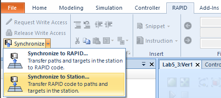

The two images bellow show the synchronized environment, executing each trajectory at the order of the inputs. This ones can be controlled with the right panel.

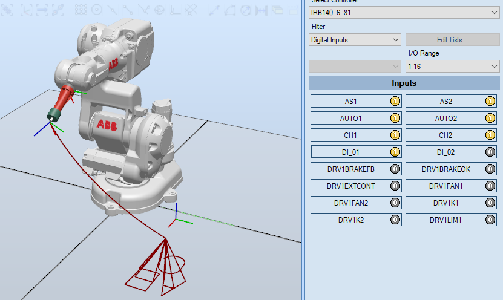
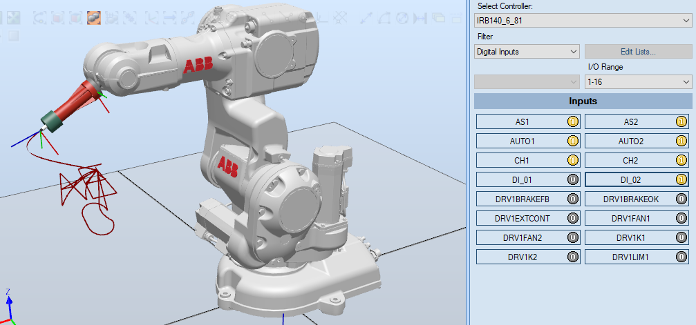

The full simulation can bee seen [here](https://www.youtube.com/watch?v=tKo-fJIsRrs)

For the physical implementation a DSQC 652 module like the one in the image bellow, is needed to add I/O support to the controller, this module uses a communication protocol called DeviceNet to translate digital data to 24 volt signals.

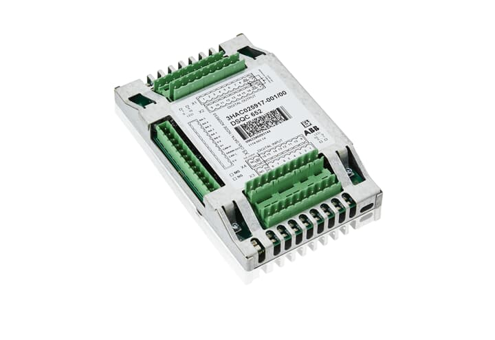

In addition to that a control box with some buttons is needed, fortunately the lab already has one properly connected to the DSQC 652 module like the one in the image bellow.
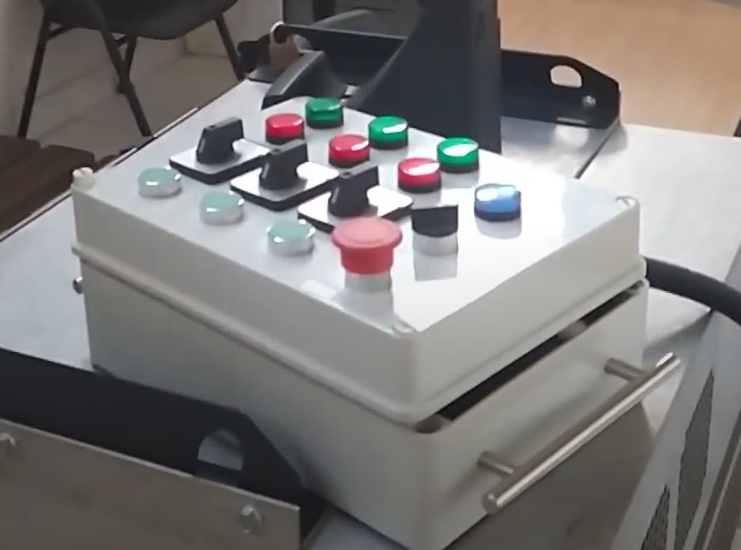

A simplified diagram of the full connection including the IRB140 is showed bellow for illustrative purposes.

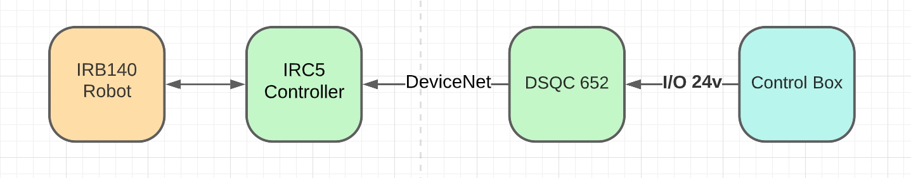

Finally the physical implementation can be seen [here](https://www.youtube.com/watch?v=5Umj_LPHBDM)

# Pick and Place with pneumatic actuator and I/O

The second part of the laboratory proposes the development of a pick and place task, using a pneumatic actuator to pick up one of three objects depending on the actuation of three buttons (one button for each object), and then put it in one of six predefined positions according to the actuation of six different buttons.

The selected actuator is a suction cup due to the availability of a free CAD model [here](https://grabcad.com/library/vacuum-grippers-robotiq-1) that allow us to execute a good simulation of the task.

At physical level we will need a Pneumatic circuit including a Compressor to generate the pressurized air, a maintenance unit to properly filter and lubricate the system, a suction cup to pick the objects, a vacuum generator that generates negative pressure thanks to the venturi effect, and finally a 4/2 way pneumatic valve so is posible to enable or disable the vacuum generator which means that the operation of the suction cup can be controlled at will at any time through the valve solenoid. The image bellow show the full diagram including an illustrative image of the real element.

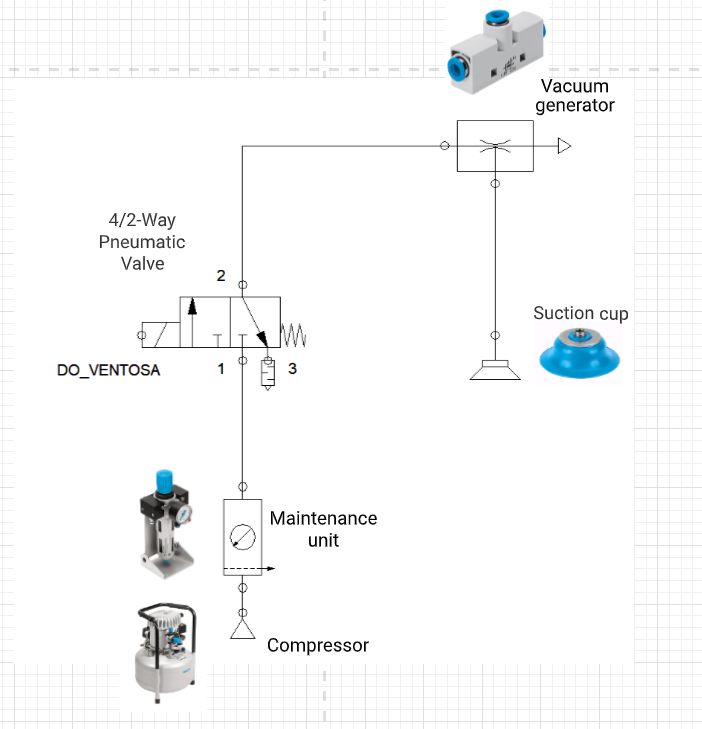

This circuit is simulated with FluidSim to ensure its appropriate behavior.

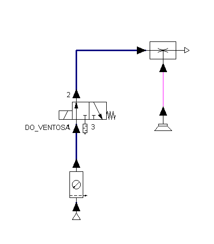

THe image bellow shows a simplified diagram of the full system, including a contactor due to the fact that the DSQC652 signals are only logic signals so they probably can't supply enough current to drive the solenoid.

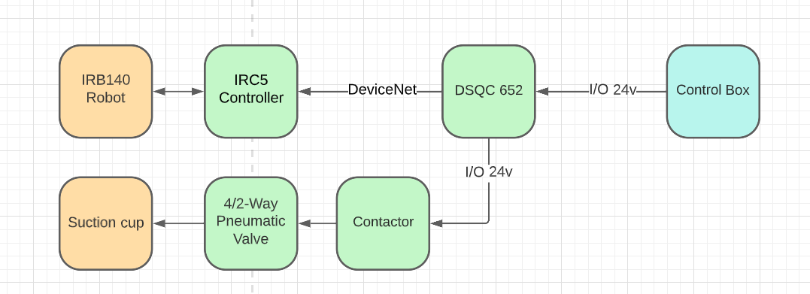

The tool is imported to RobotStudio using Fusion360 to open the .step file and exported as a .sat file so RobotStudio is able to open it.

Three boxes with different colors were design inside RobotStudio to emulate the real objects, each one with a volume of 200mm x 200mm x 200mm, in addition to a 3x2 pallet with six 240mm x 240mm compartments with 20mm gap between them. The full setup is showed in the image bellow.

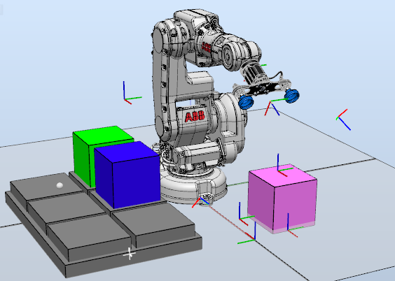

In order to be able to move the objects and allow interactions between them, some physics simulations must be enabled for the pallet, in this case is configured as a fixed object that interacts with another objects (the three boxes). The image bellow shows the procedure to do this configuration.

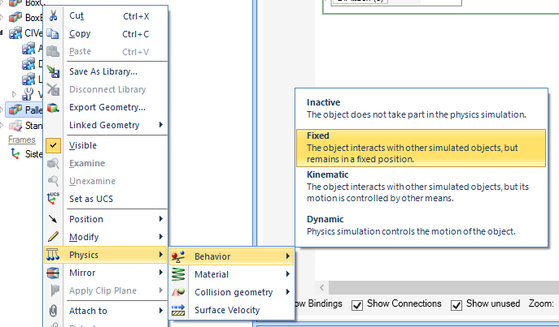

In the same way as the first part, the digital input and outputs are defined, in this case there is 3 buttons to select which box should be pick it, and 6 more to select in which of the 6 compartments should be place the box. An additional output called `DO_Ventosa` is defined to allow to control the gripper, in this case turn on or off the valve of the suction cup. All of this is done in the `Configuration -I/O System` option in RobotStudio.

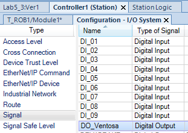

After the signals are created we need te restart the controller in the same way as the physical controller.


We can be verify if the controller is ready to use the signals by looking at the simulation tab in the right panel, the image bellow show us all the signals we need.

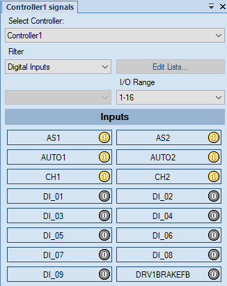

To be able to move the objects with the gripper, a smart component is defined for the tool, this option allow us to attach a digital signal with the enable of the smart component so it can fix nearby objects to himself which allows to simulate the behavior of the real suction cup. The connection between the signal and the smart component is showed in the image bellow.

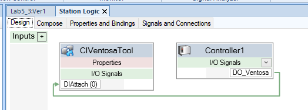

With all the preparations done all the targets and trajectories can now be defined, for a total of 9 different trajectories three for picking and six for placing.

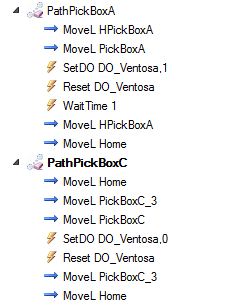

Finally the code is generated so we will be able to modify it and add the necessary logic to achieve the desired behavior. At each path some routines to control the gripper were added, with `SETDO DO_Ventosa, 1` and `RESET DO_Ventosa` the signal for the suction cup is enable or disable according to the first command argument, 1 to enable it and 0 to disable it, the three pick trajectories use 1, and the six place trajectories use 0. with `WaitTime 1` some dead time is added to give the actuator enough time to develop the process.

The main logic is very similar to the first part. An infinite loop is executed waiting for the press of on of the first three buttons an the then for the other 6 buttons, executing the specific trajectory according to the pressed button. The final code is showed bellow and the module ready for use with the real robot can be found [here](Module1PickAndPlace.mod).

```rapid
MODULE Module1
    CONST robtarget HPickBoxA:=[[100,-100,210],[0,0,1,0],[0,0,0,0],[9E+09,9E+09,9E+09,9E+09,9E+09,9E+09]];
    CONST robtarget PickBoxA:=[[0,0,0],[0,0.923879532,0.382683434,0],[0,0,0,0],[9E+09,9E+09,9E+09,9E+09,9E+09,9E+09]];
    CONST robtarget Home:=[[665.640325542,0,587.5],[0.5,0,0.866025404,0],[0,0,0,0],[9E+09,9E+09,9E+09,9E+09,9E+09,9E+09]];
    CONST robtarget PickBoxC_2:=[[0,250,210],[0,-0.382683433,0.923879532,0],[0,0,0,0],[9E+09,9E+09,9E+09,9E+09,9E+09,9E+09]];
    CONST robtarget PickBoxC:=[[0,250,0],[0,-0.382683433,0.923879532,0],[0,0,0,0],[9E+09,9E+09,9E+09,9E+09,9E+09,9E+09]];
    CONST robtarget HpickBoxE:=[[-300,300,210],[0,0.923879532,0.382683433,0],[0,0,-2,0],[9E+09,9E+09,9E+09,9E+09,9E+09,9E+09]];
    CONST robtarget PickBoxE:=[[-250,250,0],[-0.000000001,0.923879532,0.382683433,0],[0,-1,-2,0],[9E+09,9E+09,9E+09,9E+09,9E+09,9E+09]];
    CONST robtarget HPlaceP1:=[[326.099,15.996,24.976],[0.000000001,0.382683432,0.923879533,0],[0,0,0,0],[9E+09,9E+09,9E+09,9E+09,9E+09,9E+09]];
    CONST robtarget PlaceP1:=[[260,0,-210],[0,0.382683432,0.923879533,0],[0,0,0,0],[9E+09,9E+09,9E+09,9E+09,9E+09,9E+09]];
    CONST robtarget HPlaceP2:=[[260,-260,0],[0.353553391,0.35355339,0.85355339,-0.146446609],[0,0,0,0],[9E+09,9E+09,9E+09,9E+09,9E+09,9E+09]];
    CONST robtarget PlaceP2:=[[260,-260,-210],[0,0.382683432,0.923879533,0],[-1,0,-1,0],[9E+09,9E+09,9E+09,9E+09,9E+09,9E+09]];
    CONST robtarget HPlaceP4:=[[0,-260,0],[0.000000001,0.382683432,0.923879533,0],[0,0,0,0],[9E+09,9E+09,9E+09,9E+09,9E+09,9E+09]];
    CONST robtarget PlaceP4:=[[0,-260,-210],[0.000000001,0.382683432,0.923879533,0],[0,0,0,0],[9E+09,9E+09,9E+09,9E+09,9E+09,9E+09]];
    CONST robtarget HPlaceP3:=[[0,0,0],[0.000000001,0.382683432,0.923879533,0],[0,0,0,0],[9E+09,9E+09,9E+09,9E+09,9E+09,9E+09]];
    CONST robtarget PlaceP3:=[[0,0,-210],[0,0.382683432,0.923879533,0],[0,0,0,0],[9E+09,9E+09,9E+09,9E+09,9E+09,9E+09]];
    CONST robtarget HPlaceP6:=[[-260,-260,0],[-0.000000001,0.923879532,0.382683433,0],[-2,0,0,0],[9E+09,9E+09,9E+09,9E+09,9E+09,9E+09]];
    CONST robtarget PlaceP6:=[[-260,-260,-210],[-0.000000001,0.923879532,0.382683433,0],[-2,0,0,0],[9E+09,9E+09,9E+09,9E+09,9E+09,9E+09]];
    CONST robtarget HPlaceP5:=[[-260,0,0],[0,0.923879532,0.382683433,0],[-2,0,0,0],[9E+09,9E+09,9E+09,9E+09,9E+09,9E+09]];
    CONST robtarget PlaceP5:=[[-260,0,-210],[0,0.923879532,0.382683433,0],[-2,0,0,0],[9E+09,9E+09,9E+09,9E+09,9E+09,9E+09]];
    CONST robtarget PickBoxC_3:=[[0,250,210],[0,-0.382683433,0.923879532,0],[0,0,0,0],[9E+09,9E+09,9E+09,9E+09,9E+09,9E+09]];

    PROC main()
        MoveL Home,v1000,z100,TCPVentosaTool\WObj:=wobj0;
        PathPlaceP2;
        PathPickBoxA;
        WHILE TRUE DO
            IF DI_01=1 THEN
                PathPickBoxA;
            ELSEIF DI_02=1 THEN
                PathPickBoxC;
            ELSEIF DI_03=1 THEN
                PathPickBoxE;
            ENDIF
            IF DI_04=1 THEN
                PathPlaceP1;
            ELSEIF DI_05=1 THEN
                PathPlaceP2;
            ELSEIF DI_06=1 THEN
                PathPlaceP3;
            ELSEIF DI_07=1 THEN
                PathPlaceP4;
            ELSEIF DI_08=1 THEN
                PathPlaceP5;
            ELSEIF DI_09=1 THEN
                PathPlaceP6;
            ENDIF

        ENDWHILE

    ENDPROC
PROC PathPickBoxA()
        MoveL HPickBoxA,v1000,z100,TCPVentosaTool\WObj:=WO_Pick;
        MoveL PickBoxA,v500,fine,TCPVentosaTool\WObj:=WO_Pick;
        SETDO DO_Ventosa, 1;
        RESET DO_Ventosa;
        WaitTime 1;
        MoveL HPickBoxA,v1000,z100,TCPVentosaTool\WObj:=WO_Pick;
        MoveL Home,v1000,z100,TCPVentosaTool\WObj:=wobj0;
    ENDPROC
    PROC PathPickBoxC()
        MoveL Home,v1000,z100,TCPVentosaTool\WObj:=wobj0;
        MoveL PickBoxC_3,v1000,z100,TCPVentosaTool\WObj:=WO_Pick;
        MoveL PickBoxC,v300,fine,TCPVentosaTool\WObj:=WO_Pick;
        SETDO DO_Ventosa, 0;
        RESET DO_Ventosa;
        MoveL PickBoxC_3,v1000,z100,TCPVentosaTool\WObj:=WO_Pick;
        MoveL Home,v1000,z100,TCPVentosaTool\WObj:=wobj0;
    ENDPROC
    PROC PathPickBoxE()
        MoveL HpickBoxE,v1000,z100,TCPVentosaTool\WObj:=WO_Pick;
        MoveL PickBoxE,v500,fine,TCPVentosaTool\WObj:=WO_Pick;
        SETDO DO_Ventosa, 0;
        RESET DO_Ventosa;
        WaitTime 1;
        MoveL HpickBoxE,v1000,z100,TCPVentosaTool\WObj:=WO_Pick;
        MoveL Home,v1000,z100,TCPVentosaTool\WObj:=wobj0;
    ENDPROC
    PROC PathPlaceP1()
        MoveL HPlaceP1,v1000,z10,TCPVentosaTool\WObj:=WO_Place;
        MoveL PlaceP1,v300,fine,TCPVentosaTool\WObj:=WO_Place;
        SETDO DO_Ventosa, 1;
        RESET DO_Ventosa;
        WaitTime 1;
        MoveL HPlaceP1,v1000,z100,TCPVentosaTool\WObj:=WO_Place;
        MoveL Home,v1000,z100,TCPVentosaTool\WObj:=wobj0;
    ENDPROC
    PROC PathPlaceP2()
        MoveL HPlaceP2,v1000,z5,TCPVentosaTool\WObj:=WO_Place;
        MoveL PlaceP2,v300,fine,TCPVentosaTool\WObj:=WO_Place;
        SETDO DO_Ventosa, 0;
        RESET DO_Ventosa;
        WaitTime 1;
        MoveL HPlaceP2,v1000,z100,TCPVentosaTool\WObj:=WO_Place;
        MoveL Home,v1000,z100,TCPVentosaTool\WObj:=wobj0;
    ENDPROC
    PROC PathPlaceP4()
        MoveL HPlaceP4,v1000,z5,TCPVentosaTool\WObj:=WO_Place;
        MoveL PlaceP4,v300,fine,TCPVentosaTool\WObj:=WO_Place;
        SETDO DO_Ventosa, 1;
        RESET DO_Ventosa;
        WaitTime 1;
        MoveL HPlaceP4,v1000,z100,TCPVentosaTool\WObj:=WO_Place;
        MoveL Home,v1000,z100,TCPVentosaTool\WObj:=wobj0;
    ENDPROC
    PROC PathPlaceP3()
        MoveL HPlaceP3,v1000,z5,TCPVentosaTool\WObj:=WO_Place;
        MoveL PlaceP3,v300,fine,TCPVentosaTool\WObj:=WO_Place;
        SETDO DO_Ventosa, 1;
        RESET DO_Ventosa;
        WaitTime 1;
        MoveL HPlaceP3,v1000,z100,TCPVentosaTool\WObj:=WO_Place;
        MoveL Home,v1000,z100,TCPVentosaTool\WObj:=wobj0;
    ENDPROC
    PROC PathPlaceP6()
        MoveL HPlaceP6,v1000,z5,TCPVentosaTool\WObj:=WO_Place;
        MoveL PlaceP6,v300,fine,TCPVentosaTool\WObj:=WO_Place;
        SETDO DO_Ventosa, 1;
        RESET DO_Ventosa;
        WaitTime 1;
        MoveL HPlaceP6,v1000,z100,TCPVentosaTool\WObj:=WO_Place;
        MoveL Home,v1000,z100,TCPVentosaTool\WObj:=wobj0;
    ENDPROC
    PROC PathPlaceP5()
        MoveL HPlaceP5,v1000,z5,TCPVentosaTool\WObj:=WO_Place;
        MoveL PlaceP5,v300,fine,TCPVentosaTool\WObj:=WO_Place;
        SETDO DO_Ventosa, 1;
        RESET DO_Ventosa;
        WaitTime 1;
        MoveL HPlaceP5,v1000,z100,TCPVentosaTool\WObj:=WO_Place;
        MoveL Home,v1000,z100,TCPVentosaTool\WObj:=wobj0;
    ENDPROC
ENDMODULE
```

All the changes in the code can be resynchronized with the RobotStudio environment using the next option.


Finally the full simulation is executed, a video prove can be found [here](https://www.youtube.com/watch?v=OrLED6QgCuY)

## Conclusions

Digital I/O play a fundamental role in robotics, specially in real industrial applications, at the end of the day we can have a complex task programmed with a robot, but without the capability to control at least a simple servo gripper an receiving feedback from the world to know when the task should be executed, the robot turns into a very expensive toy making this practice fundamental in the case of a professional path in industrial robotics.

During the development of the lab, specially with the second part, some doubts arose about a real industrial application, this kind of robots could be very dangerous if not use properly. In this case the IRB140 was only used in debug mode at a fairly slow speed, far from the reality when more velocity in the process means more cost effectiveness for the robot, that means that in the real world the code has to be develop very carefully, adding as many security measures as possible, especially if the robot must work near humans, so a simple code such as the one develop here it wouldn't be enough for a real industrial application, adding sensors and rigorously testing is necessary to ensure proper operation in a real industrial application.
